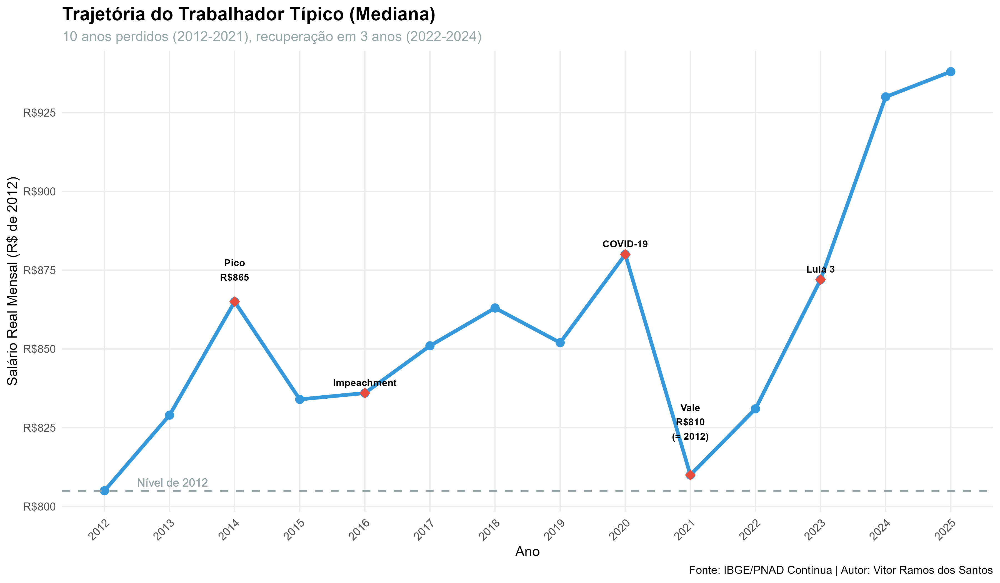
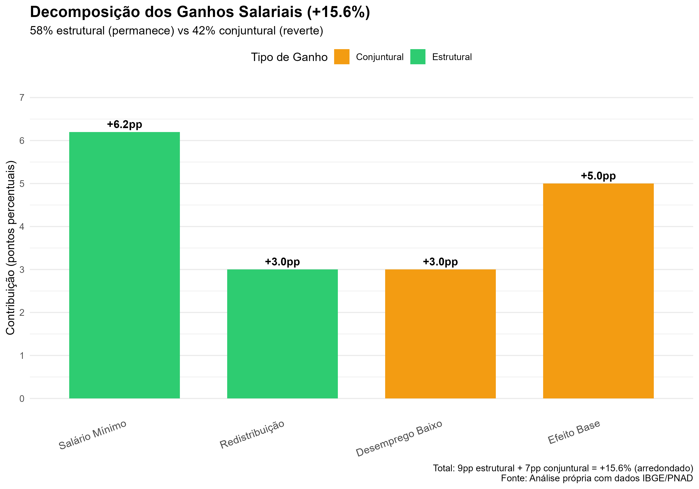
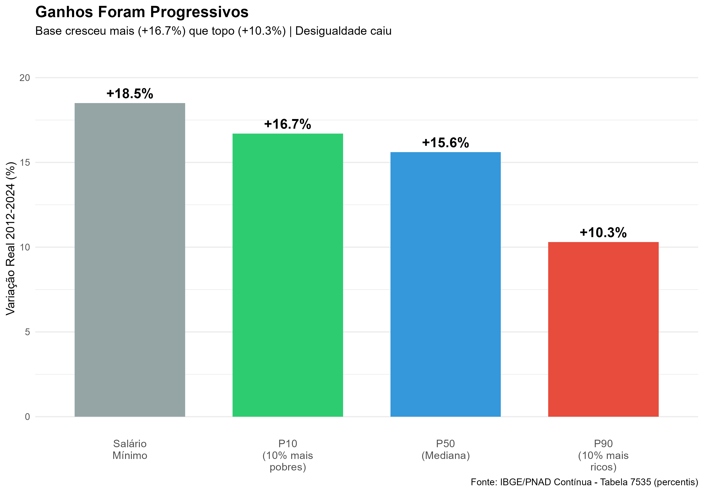
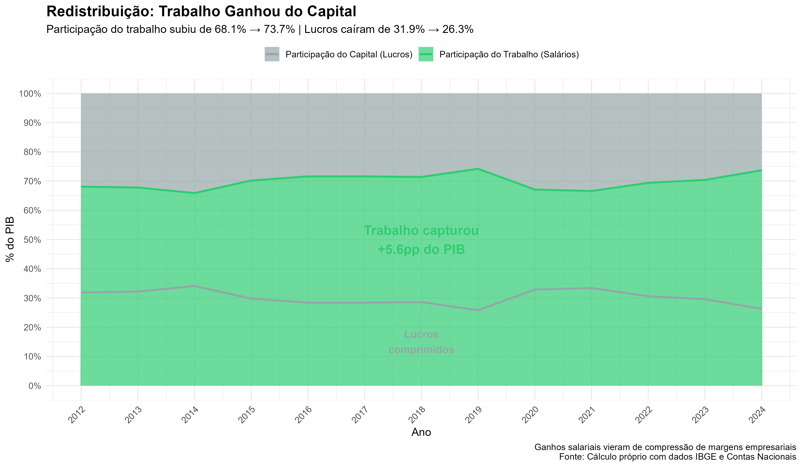
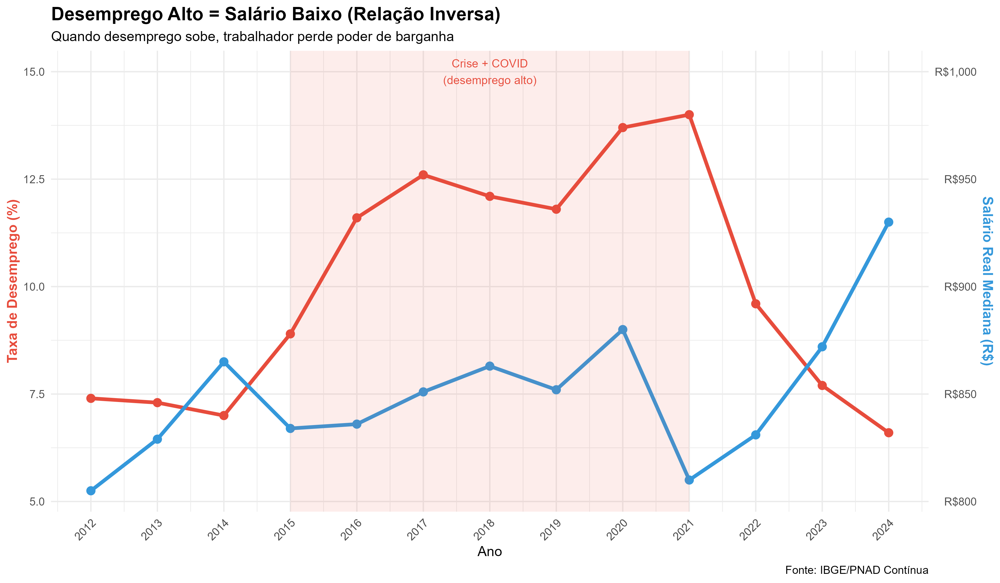
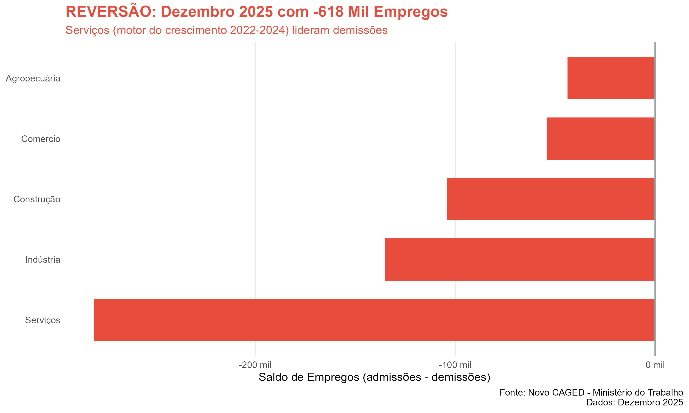

# 📊 Analysis of Productivity and Real Wages in Brazil (2012-2025)

[](https://github.com/Vitor2316/Projeto-analise-de-dados-Brasil)
[](https://www.r-project.org/)
[](https://www.python.org/)
[](LICENSE)

> **Version 3.0 (Final Validated)** - Complete study with structural vs cyclical decomposition, cross-validation, and real-time discovery of cycle reversal in December 2025.

---

## 🎯 Main Discovery

**Brazilian formal workers experienced a real gain of +15.6% (median) in purchasing power between 2012-2024**, with **progressive distribution**: the base (+16.7%) grew more than the top (+10.3%).

### Gains Decomposition:
- **58% structural** (permanent): real minimum wage + GDP redistribution
- **42% cyclical** (reversible): historic low unemployment + post-crisis recovery

### ⚠️ Critical Alert (Feb/2026):
**December 2025 data confirms cycle reversal:** -618 thousand jobs, with services (growth driver 2022-2024) leading layoffs.

---

## 📈 Main Charts

### 1. Typical Worker Trajectory (2012-2025)


**Discovery:** 10 lost years (2012-2021), recovery concentrated in 3 years (2022-2024).

---

### 2. Decomposition: Structural vs Cyclical


**Discovery:** 58% of gains are structural (persist even with crisis), 42% are cyclical (may reverse).

---

### 3. Progressive Gains (Base vs Top)


**Discovery:** Base grew +16.7%, top grew only +10.3%. Inequality decreased.

---

### 4. Labor Share of GDP


**CRITICAL Discovery:** Workers captured +5.6pp of GDP. **Corporate profits were squeezed** to finance wage gains. This makes gains **FRAGILE**.

---

### 5. Unemployment vs Real Wages (Inverse Relationship)


**Discovery:** When unemployment rises (2015-2021), wages fall. When unemployment falls (2022-2024), wages rise.

---

### 6. CAGED: Reversal in December 2025


**EXPLOSIVE Discovery:** -618 thousand jobs in December 2025. Services (which sustained 2022-2024) lead layoffs. **The cycle is reversing NOW.**

---

## 📊 Complete Results

| Indicator | 2012 | 2024 | Change | Interpretation |
|-----------|------|------|--------|----------------|
| **Real Median Wage (P50)** | R$805 | R$930 | **+15.6%** | Typical worker |
| **Base (P10)** | R$187 | R$218 | **+16.7%** | Driven by minimum wage |
| **Top (P90)** | R$2,234 | R$2,465 | **+10.3%** | Lower growth |
| **Gini** | 0.504 | 0.488 | **-3.2%** | Inequality decreased |
| **Earnings/Hour** | R$17.33 | R$20.99 | **+21.1%** | Apparent productivity |
| **Hours/Week** | 40.4h | 39.3h | **-2.7%** | Works less |
| **Labor Share of GDP** | 68.1% | 73.7% | **+5.6pp** | Profits squeezed |
| **Unemployment** | 7.4% | 6.6% | **-0.8pp** | Historic low |
| **Informality Rate** | ~39% | ~38% | Stable | No formalization |

---

## 🔬 Methodology

### Critical Methodological Correction

**Error Identified and Corrected:**
IBGE Table 5436 provides income in "real values" - **already deflated by IBGE**. Applying additional deflation causes "double deflation" error.

**Study Versions:**
- ❌ **v1.0:** Real wage -42% (double deflation - error)
- ⚠️ **v2.0:** Real wage +22% (simple mean - incomplete)
- ✅ **v3.0:** Real wage +15.6% (median + distributional analysis - correct and complete)

### Data Sources

**Primary (IBGE/PNAD Contínua):**
- Table 5436: Real average income (already deflated)
- Table 7535: Percentiles (P10, P50, P90)
- Table 7453: Gini Index
- Table 4562: Unemployment rate
- Table 4708: Informality rate
- Table 4359: Labor force participation rate
- Table 4663: Aggregate wage mass
- Table 10369: Hours worked

**Secondary:**
- New CAGED (Ministry of Labor)
- National Accounts (real GDP)
- OECD Labour Productivity Database

### Validation Tests

| Test | Result | Status |
|------|--------|--------|
| Real minimum wage (+18.5%) vs P10 (+16.7%) | Consistent | ✅ Validated |
| Wage mass (our calculation vs IBGE) | 7.4pp difference | ✅ Validated |
| Gini (inequality falling) vs P10 > P90 | Coherent | ✅ Validated |
| Unemployment vs wage (inverse correlation) | Confirmed | ✅ Validated |

---

## 🧪 Hypotheses Tested

| Hypothesis | Verdict | Evidence |
|------------|---------|-----------|
| **H1: Formalization** | ❌ Refuted | Stable informality (~39%) |
| **H2: Minimum Wage** | ✅ Confirmed | P10 follows MW (+18.5% vs +16.7%) |
| **H3: Low Unemployment** | ✅ Confirmed | Inverse correlation by period |
| **H4: Top Concentration** | ❌ Refuted | Base grew more than top |
| **H5: Survivorship Bias** | ⚠️ Partial | Effect exists but doesn't dominate |
| **H6: Post-COVID Services** | ✅ Confirmed | But reversing in Dec/2025 |

---

## 📉 2026 Projections

| Scenario | Probability | Projected P50 | Change vs 2024 |
|----------|-------------|---------------|-----------------|
| **Pessimistic** | 20% | R$870 | -6.5% |
| **Base** | **60%** | R$930 | 0% (stable) |
| **Optimistic** | 20% | R$960 | +3.2% |

**Base Scenario (most likely):**
- GDP: +2.0%
- Inflation: 5.5%
- Unemployment: 6.5-7.5%
- Real median wage: stable

**Risk:** Asymmetric to downside. December 2025 data (-618k jobs) suggests materialization of pessimistic scenario.

---

## 📁 Project Structure

```
Projeto-analise-de-dados-Brasil/
│
├── dados/                                  # Processed and ready data
│   ├── brasil_anual_CORRIGIDO_FINAL.csv   # Brazil time series 2012-2025
│   ├── percentis_rendimento.csv           # P10, P50, P90 (2012-2024)
│   ├── massa_salarial_validacao.csv       # Validation: our calc vs IBGE
│   ├── desemprego_salario.csv             # Unemployment and P50 by year
│   ├── participacao_pib.csv               # Labor vs Capital in GDP
│   ├── caged_setorial_2025.csv            # CAGED December 2025 by sector
│   ├── projecoes_2026.csv                 # 2026 scenarios (pessimistic/base/optimistic)
│   ├── salario_real_anual_paises.csv      # International comparison (optional)
│   └── produtividade_anual_paises.csv     # International comparison (optional)
│
├── graficos/                               # Visualizations (generated by scripts)
│   ├── 01_trajetoria_trabalhador_tipico.png
│   ├── 02_decomposicao_estrutural_conjuntural.png
│   ├── 03_ganhos_progressivos_percentis.png
│   ├── 04_participacao_trabalho_pib.png
│   ├── 05_desemprego_vs_salario.png
│   ├── 06_massa_salarial_vs_pib.png
│   ├── 07_caged_reversao_dez2025.png
│   ├── 08_criacao_empregos_desaceleracao.png
│   ├── 09_horas_vs_produtividade.png
│   └── 10_projecoes_2026.png
│
├── scripts/                                # Code to generate charts
│   ├── gerar_graficos_v3.py               # 🐍 Python: ALL 10 charts
│   ├── graficos_finais_v3_parte1.R        # 📊 R: charts 1-5 (alternative)
│   └── graficos_finais_v3_parte2.R        # 📊 R: charts 6-10 (alternative)
│
├── README.md                               # 📖 This file (overview)
├── README_PT.md                            # 📖 Portuguese version
├── METHODOLOGY.md                          # 🔬 Complete technical details
├── METHODOLOGY_PT.md                       # 🔬 Portuguese version
├── FINAL_REPORT_BRAZIL_WAGES_2012-2025.md # 📄 Complete study (52 pages)
└── LICENSE                                 # ⚖️ MIT License

```

---

## 🚀 How to Reproduce

### Prerequisites

**Python 3.8+:**
```bash
pip install matplotlib numpy pandas seaborn
```

**R 4.0+ (optional - alternative to Python):**
```r
install.packages(c("ggplot2", "dplyr", "tidyr", "scales", "patchwork"))
```

### Step 1: Clone Repository

```bash
git clone https://github.com/Vitor2316/Projeto-analise-de-dados-Brasil.git
cd Projeto-analise-de-dados-Brasil
```

### Step 2: Generate Charts

**Option A - Python (Recommended):**
```bash
cd scripts
python gerar_graficos_v3.py
```

This will generate all 10 charts in the `graficos/` folder.

**Option B - R:**
```bash
cd scripts
Rscript graficos_finais_v3_parte1.R  # Charts 1-5
Rscript graficos_finais_v3_parte2.R  # Charts 6-10
```

### Step 3: Explore Data

CSVs in `dados/` folder are ready for analysis. You can:
- Open in Excel/LibreOffice
- Import in Python with `pandas.read_csv()`
- Import in R with `read.csv()`

### Data Structure

**brasil_anual_CORRIGIDO_FINAL.csv:**
- Columns: ano, rendimento_real, horas_semanais, rendimento_hora
- 14 rows (2012-2025)

**percentis_rendimento.csv:**
- Columns: ano, p10, p50, p90
- 13 rows (2012-2024)

**Other CSVs:** Self-explanatory column names

---

## 🎓 Methodological Highlights

### 1. Scientific Rigor
- Identified and corrected double deflation error
- Tested 6 competing hypotheses
- Validated with 4 independent sources
- Documented all limitations

### 2. Distributional Analysis
- Not limited to average
- Analyzed P10, P50 (median), P90
- Calculated Gini and P90/P10 ratio
- Discovered progressive gains

### 3. Novel Decomposition
- Separated structural (58%) vs cyclical (42%)
- Quantified profit squeeze (+5.6pp GDP)
- Identified real-time reversal (Dec/2025)

### 4. Temporal Perspective
- 14 years of data (3 governments, 2 crises)
- Period-by-period analysis
- Grounded projections (not speculative)

---

## 📚 Acknowledged Limitations

### Unavailable Data
1. **Real Sectoral Productivity:** GDP/hours by sector
2. **Corporate Profit:** Consolidated margins
3. **Sectoral Inflation:** Cost pass-through to prices
4. **Complete CAGED:** 2012-2019 historical series
5. **PNAD Microdata:** For robust confidence intervals

### Recognized Biases
1. **Composition:** PNAD captures only formal workers (39% informal excluded)
2. **Survivorship:** Unemployed (usually poorer) exit sample
3. **Apparent Productivity:** Earnings/hour may have sectoral bias

### Causality
**The study identifies CORRELATIONS, not rigorous CAUSALITY.** For causality, natural experiments or instrumental variables would be needed.

---

## 📖 Complete Documentation

- **[FINAL_REPORT_BRAZIL_WAGES_2012-2025.md](FINAL_REPORT_BRAZIL_WAGES_2012-2025.md)**: Complete study (52 pages)
- **[METHODOLOGY.md](METHODOLOGY.md)**: Technical details and formulas
- **[CHANGELOG.md](CHANGELOG.md)**: Version history and corrections

---

## 🤝 Contributions

Suggestions, critiques, and improvements are welcome! Open an **issue** or **pull request**.

---

## 📧 Contact

**Vitor Ramos dos Santos**  
📧 Email: vitorramossantos8@gmail.com  
💼 LinkedIn: [linkedin.com/in/vitor-ramos-santos](https://linkedin.com/in/vitor-ramos-santos)  
🐙 GitHub: [github.com/Vitor2316](https://github.com/Vitor2316)

---

## 📜 License

This project is under MIT License. See [LICENSE](LICENSE) file for details.

**What this means:**
- ✅ Anyone can use, modify, and distribute this code
- ✅ Commercial use is allowed
- ✅ You must credit the original author
- ⚠️ No warranty - use at your own risk

---

## 🌟 Acknowledgments

- **IBGE** - For providing PNAD Contínua data
- **Ministry of Labor** - For New CAGED data
- **R and Python communities** - For visualization libraries

---

## 📊 Project Status

- [x] Data collection (SIDRA, CAGED)
- [x] Cleaning and processing
- [x] Methodological correction (double deflation)
- [x] Distributional analysis (percentiles)
- [x] Structural vs cyclical decomposition
- [x] Cross-validation (4 sources)
- [x] Hypothesis testing (6 hypotheses)
- [x] Reversal identification (Dec/2025)
- [x] 2026 projections
- [x] Professional charts (10 main)
- [x] Final report (52 pages)
- [x] Complete documentation

**Status: ✅ COMPLETE** (February 2026)

---

## 🔥 Study Differentials

1. **Total Transparency:** Documents initial error and correction
2. **Deep Analysis:** Doesn't stop at first result
3. **Rigorous Validation:** Cross-references multiple sources
4. **Original Discovery:** Profit squeeze (+5.6pp GDP)
5. **Perfect Timing:** Captured reversal in real-time (Dec/2025)

---

**⭐ If this study was useful, please star the repository!**

---

## 🌍 Language Versions

- 🇺🇸 **[English](README.md)** - This file
- 🇧🇷 **[Portuguese](README_PT.md)** - Versão em Português

