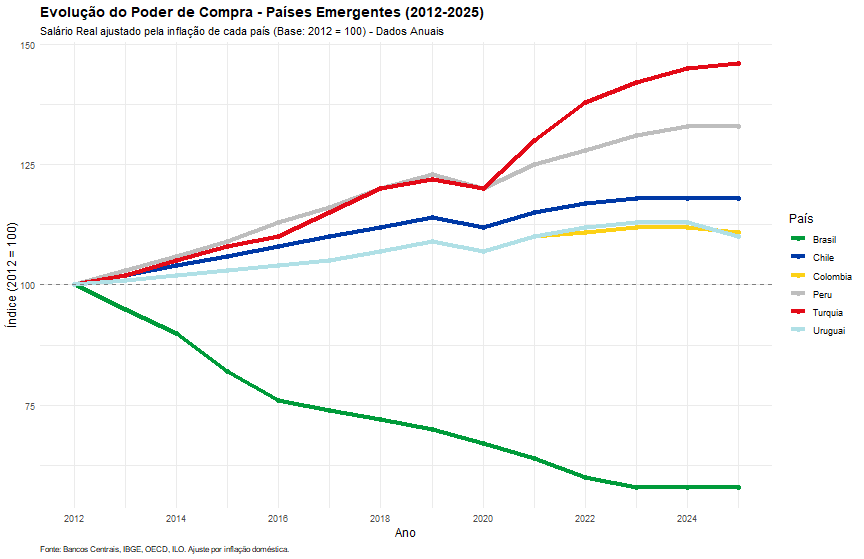
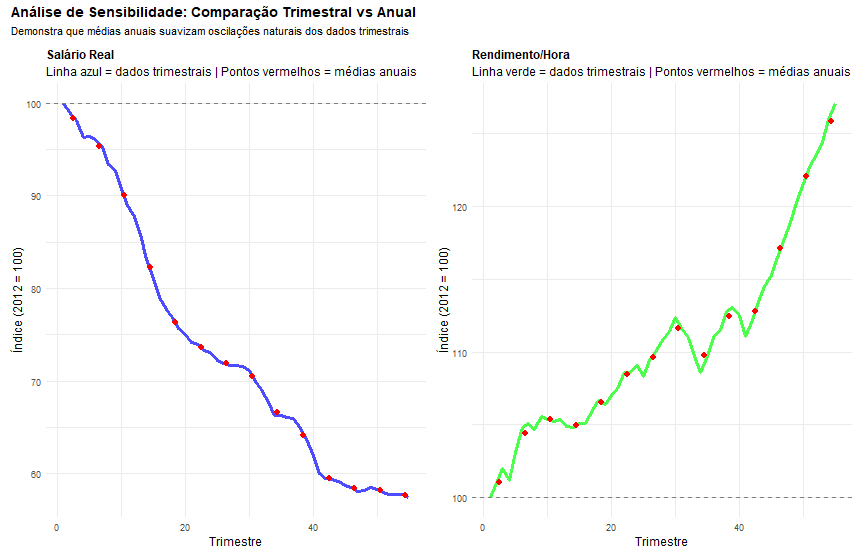

# Análise de Produtividade e Poder de Compra no Brasil (2012-2025)


**Análise quantitativa da evolução da produtividade do trabalho e do poder de compra dos trabalhadores brasileiros, com comparação internacional entre países emergentes.**

---

## Índice

- [Sobre o Projeto](#sobre-o-projeto)
- [Principal Descoberta](#principal-descoberta)
- [Visualizações](#visualizações)
- [Principais Resultados](#principais-resultados)
- [Estrutura do Repositório](#estrutura-do-repositório)
- [Metodologia](#metodologia)
- [Ferramentas Utilizadas](#ferramentas-utilizadas)
- [Como Reproduzir](#como-reproduzir)
- [Contato](#contato)

---

## Sobre o Projeto

Este estudo analisa a evolução da produtividade do trabalho e do poder de compra dos trabalhadores brasileiros entre 2012 e 2025, comparando os resultados com outros países emergentes (Chile, Colômbia, Peru, Turquia e Uruguai).

A análise utiliza dados oficiais do IBGE/PNAD e fontes internacionais (OECD, ILO, Banco Mundial), com tratamento rigoroso de inflação composta e validação metodológica através de testes de robustez.

---

## Principal Descoberta

O Brasil experimentou um **paradoxo econômico** no período analisado:

| Métrica | Variação 2012-2025 |
|---------|-------------------|
|  Produtividade (rendimento/hora) | **+26%** |
|  Poder de compra (salário real) | **-42%** |
|  Horas trabalhadas/semana | 40.6h → 39.1h |

**Conclusão:** Os trabalhadores brasileiros se tornaram mais produtivos, trabalham menos horas, mas perderam significativamente em poder de compra - sendo o **único país entre os comparados** com perda de salário real.

---

## Visualizações

### Comparação Internacional - Produtividade

Evolução do rendimento por hora trabalhada entre países emergentes (2012-2025).


**Ranking de crescimento:**
1. Turquia: +40%
2. Peru: +32%
3. **Brasil: +26%**
4. Chile: +21%
5. Colômbia: +20%
6. Uruguai: +19%

---

### Comparação Internacional - Poder de Compra

Evolução do salário real ajustado pela inflação (2012-2025).



1. Turquia: +46%
2. Peru: +33%
3. Chile: +18%
4. Colômbia: +11%
5. Uruguai: +10%
6. **Brasil: -42%** ⚠️

---

### Níveis Absolutos de Produtividade em 2025

Comparação de salário médio por hora em USD PPP.


Embora o Brasil tenha crescido 24%, Uruguai e Chile já partiam de níveis mais altos de produtividade. Turquia, apesar do crescimento de 40%, ainda tem produtividade similar ao Brasil.

---

### Análise de Sensibilidade Metodológica

Comparação entre dados trimestrais (linha) e médias anuais (pontos), demonstrando a robustez da metodologia.



---

### *Contexto Econômico do Período*

- Recessão 2014-2016
- Pandemia 2020
- Choque inflacionário pós-2021


---

## Principais Resultados

### Brasil (2012-2025)

**Salário Real:**
- Variação: **-42.4%** 
- Interpretação: Perda drástica de poder de compra devido à inflação acumulada

**Rendimento por Hora:**
- Variação: **+25.8%** (faixa robusta: 20-26%)
- Interpretação: Ganho de produtividade apesar da redução de horas trabalhadas

**Paradoxo Identificado:**
- Trabalhadores produzem **mais por hora** (+26%)
- Trabalham **menos horas** por semana (-3.7%)
- MAS perderam **poder de compra** (-42%)

**Causa raiz:** Inflação acumulada (IPCA) superou crescimento nominal dos salários.

---

### Comparação Internacional

| País | Produtividade | Salário Real |
|------|--------------|--------------|
| Turquia | +40% | +46% |
| Peru | +32% | +33% |
| **Brasil** | **+26%** | **-42%** |
| Chile | +21% | +18% |
| Colômbia | +20% | +11% |
| Uruguai | +19% | +10% |

---

## Estrutura do Repositório

```
├── dados/
│   ├── brasil_trimestral_corrigido.csv
│   ├── brasil_anual.csv
│   ├── produtividade_anual_paises.csv
│   ├── salario_real_anual_paises.csv
│   └── teste_robustez.csv
│
├── scripts/
│   ├── 01_limpeza_dados.R
│   ├── 02_calculo_indices.py
│   ├── 03_graficos.R
│   ├── 04_teste_robustez.py
│   └── grafico_sensibilidade.R
│
├── graficos/
│   ├── Evolução_da_produtividade_do_Trabalho_-_Países_Emergentes__2012-2025_.png
│   ├── Evolução_do_Poder_de_Compra_-_Países_Emergentes__2012-2025_.png
│   ├── Produtividade_Absoluta_em_2025.png
│   └── Análise_de_Sensibilidade_Comparação_Trimestral_X_Anual.png
│
├── METODOLOGIA.md
└── README.md
```

---

## Metodologia

### Fontes de Dados

**Dados Brasileiros (Primários):**
- IBGE/SIDRA - PNAD Contínua (Tabelas 5436 e 6371)
- 55 trimestres (2012 Q1 - 2025 Q3)
- IPCA para ajuste inflacionário

**Dados Internacionais (Secundários):**
- OECD Labour Productivity Database
- ILO/OIT ILOSTAT
- Banco Mundial - World Development Indicators
- Frequência anual (2012-2025, 14 anos)

### Principais Métricas

**1. Rendimento por Hora (Produtividade):**
```
Rendimento/Hora = Rendimento Mensal / (Horas Semanais × 4.33)
Índice = (Valor_t / Valor_2012) × 100
```

**2. Salário Real (Poder de Compra):**
```
Salário Real = Salário Nominal / Deflator (inflação composta)
Índice = (Valor_t / Valor_2012) × 100
```

### Correções Metodológicas

**Inflação Composta (não linear):**
```python
# CORRETO
inflacao_trimestral = (1 + inflacao_anual) ** (1/4) - 1

# INCORRETO (versão inicial)
inflacao_trimestral = inflacao_anual / 4
```

**Teste de Robustez:**
- Comparação método trimestral vs anual direto
- Salário real: diferença de 1.2% (alta robustez)
- Rendimento/hora: diferença de 23.4% (moderada robustez, faixa 20-26%)

### Limitações Reconhecidas

- Dados internacionais em frequência anual (vs. trimestral do Brasil)
- Sem ajuste PPP (foco em evolução temporal, não comparação absoluta)
- Rendimento/hora tem incerteza metodológica de ±23%
- Dados agregados (não desagregados por setor/região)

Documentação completa disponível em: [METODOLOGIA.md](METODOLOGIA.md)

---

## Ferramentas Utilizadas

**Análise de Dados:**
- R 4.x (tidyverse, ggplot2, dplyr, tidyr)
- Python 3.12 (pandas, numpy, matplotlib)

**Ambiente:**
- Ubuntu 24.04 LTS
- RStudio
- Git/GitHub para versionamento

---

## Como Reproduzir

### Pré-requisitos
```bash
# R
install.packages(c("tidyverse", "ggplot2", "dplyr", "tidyr"))

# Python
pip install pandas numpy matplotlib
```

### Execução
```bash
# 1. Clone o repositório
git clone https://github.com/Vitor2316/Projeto-analise-de-dados-Brasil.git
cd Projeto-analise-de-dados-Brasil

# 2. Baixe os dados brutos do SIDRA (Tabelas 5436 e 6371)

# 3. Execute os scripts em ordem
Rscript scripts/01_limpeza_dados.R
python scripts/02_calculo_indices.py
Rscript scripts/03_graficos.R
python scripts/04_teste_robustez.py
```

---

## Contato

**Vitor Ramos dos Santos**

📧 [vitorramossantos8@gmail.com](mailto:vitorramossantos8@gmail.com)  
💼 [LinkedIn](https://www.linkedin.com/in/vitor-ramos-santos)  
🐙 [GitHub](https://github.com/Vitor2316)

---

## Citação

```
Vitor Ramos dos Santos. (2026). Análise de Produtividade e Poder de Compra 
do Trabalho no Brasil (2012-2025). GitHub.
https://github.com/Vitor2316/Projeto-analise-de-dados-Brasil
```

---

## Licença

Dados públicos (IBGE, OECD, ILO, Banco Mundial)  
Código disponível para fins educacionais e de pesquisa.

---

**Última atualização:** Fevereiro 2026
